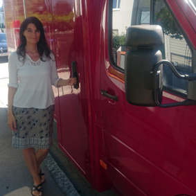 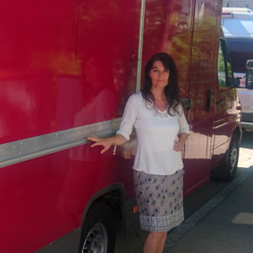 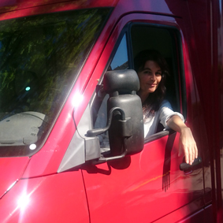

*"Biofoodtruck" RuzaNera, Food&Art, bio - organic - glutenfrei - frisch - regional - tasty*
wir sind auch online
 [www.biofoodtruck.net](http://www.biofoodtruck.net) 

## Der Winter ist da! Schnee liegt auf Hügeln und Feldern.Die Nächte werden eiskalt.Der Atem wird sichtbar. Atmen ist Leben.

## Seid kreativ.

## Neu
## Kurse für März und April 2023 sind da!

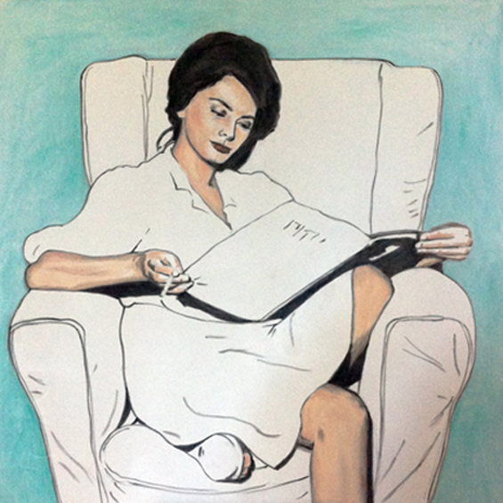
NEU *Hommage an Sophia und das Lesen eines gedruckten Buches
(Pastell auf Leinwand 80 cm x 80 cm)*
Dieses Bild ist zur Zeit im Haarer Rathaus ausgestellt.

## Mein künstlerischer Ansatz
"Jedem Lebewesen wohnt ein Zauber inne"
Ich versuche diesen Zauber im Portrait sichtbar, lebbar und fühlbar zu machen.
Ein grosser Teil meiner Arbeit ist die Auseinandersetzung mit dem Portrait von Mensch und Tier. Es fasziniert mich immer wieder, wenn auf dem Papier/Leinwand oder als Skulptur der Charakter 
eines Menschen oder eines Tieres erwacht. Ich bevorzuge eine Vielfalt an Techniken, von abstrakt, expressiv zu grafisch zeichnerisch. Mischtechniken, Fotografie, Comikelemente, und Skulpturen aus Ton und Bronze. Mit jedem Stilelement und Materiel kann ich ganz verschiedene Gefühle ausdrücken, von mächtig-kraftvoll zu fein-zart bis hin zu einem Hauch.
Einige meiner Portraits sind in meinem eigenen, einzigartigen Stil gemalt. Eine Kombination aus Kohlezeichnung und Öl- oder Gouachefarbe als Hintergrund auf Leinwand gemalt.

Bevorzugte Materialien:
Ungiftige natürliche Farben wie Aquarellfarben, Gouache, Pastell und Pastellölkreide, Bleistift, Ölfarben auf Wasserbasis, Polychromostifte, Ton, Bronze, Blattgold.

Bevorzugte Themen:
Mensch und Tier. Die Natur. Weiblichkeit. Schönheit. Gegensätze. Erhaltung der Natur. Der Wolf. Porträts. Erdung. Gerechtigkeit. Mut und Freiheit.

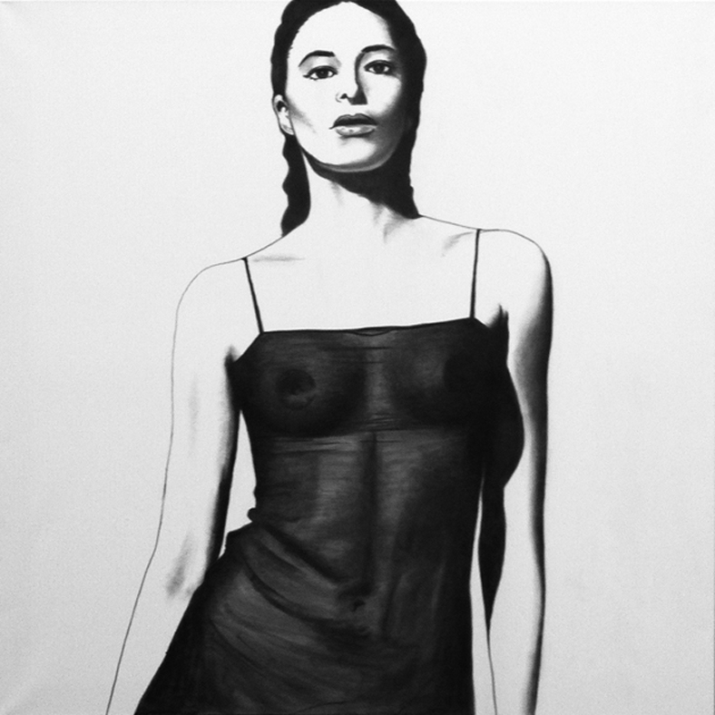

*Licht und Schatten "Starke Frau" mit Grautönen dazwischen  
(Kohle/Pastell auf Leinwand 1m x 1m)*

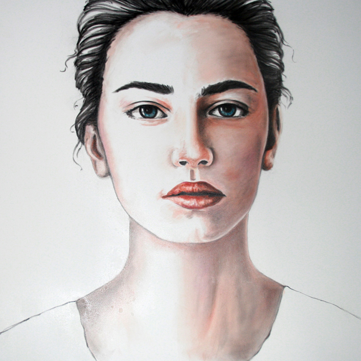

## "Atem ist Leben" Pastellkreide auf Leinwand (80 x 80 cm) Juli 2020

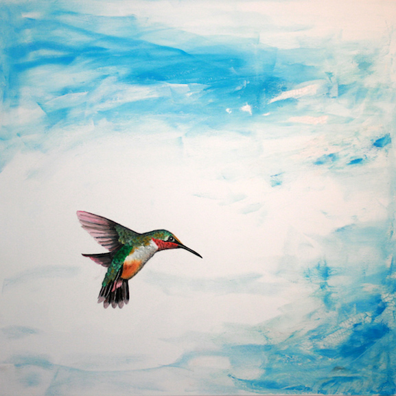

*"Hummigbird II" Gouache/Pastellkreide 70 x 70*
"Leben ist nicht genug sagte der Vogel,
Sonnenschein, Freiheit und eine Blume gehören auch dazu"

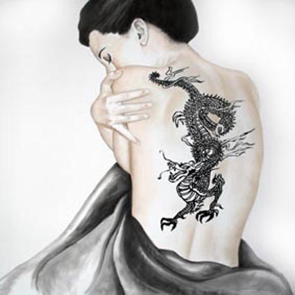

*"Spur auf der Haut (Drachentatoo)"  Gouache/Pastellkreide auf Leinwand (80 x 80)*

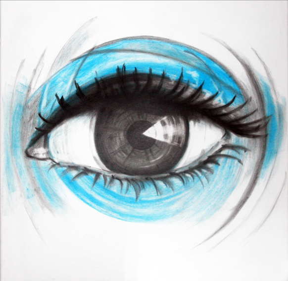

*"Auge (Watchingyou)"  Pastellkreide auf Leinwand (50 x 50)*

## neue Projekte:

- Hilfe und Beratung beim Erstellen einer Mappe
- Gestaltung Ihrer Speisekarte 
- Mal- und Zeichenkurse (siehe Kurse und unten)
- [glutenfreies Essen](http://www.biofoodtruck.net) Unser Biofoodtruck "RuzaNera-Food&Art".    

Wir sind in München und Umgebung unterwegs.    

- Kinder- und Jugendbuch
- Kalligrafie und Handlettering
- Auftragsarbeiten
- Portrait nach Ihren Wünschen (Auftragsarbeit)

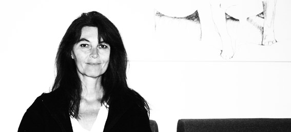

* Karina Schlaffer (in ihrem Atelier in München-Trudering) *

## Private Kunst- und Zeichenschule in München-Trudering.
 

# Sie können gerne einen Gutschein für Einzelunterricht verschenken!

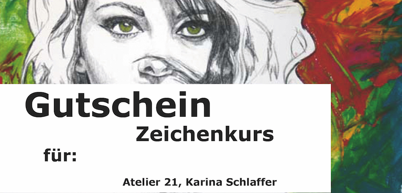

"Gutschein" 
Infos: kschlaffer@web.de

# Kursangebot Winter/Frühjahrssemester 2023 Atelier 21:

## Kurse von Karina Schlaffer: 
(mehr Infos:  [Presse](http://www.schlaffer.net/muenchen-presse.php "Presse Karina Schlaffer"))

Die Kurse finden in der Edeltraudstr. 21 statt. 
Leider darf ich keine Kurse mehr in der VHS Haar geben,
da ich mich weigerte den Gesundheitsstatus meiner Schüler abzufragen.
Ich bin der Meinung, dass diese Daten unter den Datenschutz fallen.
Es tut mir sehr leid, für alle meine Schüler, die gerne zu mir in den Kurs gekommen sind. Es hat viel Spaß mit euch gemacht.

Nun biete ich Kurse in meinem Atelier 21 an. 
Jeder ist herzlich willkommen.

## Für Winter/Frühjahr 2023 sind Kurse im Atelier21 geplant.

Figürliches Zeichnen, fortlaufender Kurs, jeden Mittwoch 
Mittwoch von 18.00 bis 19.30 Uhr 
Ort: Edeltraudstr. 21

## März 2023
Aquarellmalen, 18. März 2023
Samstag von 11.00 Uhr bis 16.00 Uhr
Ort: Atelier 21, Edeltraudstr. 21, München
Für Anfänger und Fortgeschrittene, 110 Euro

Handlettering/Kalligrafie, 19. März 2023
Sonntag von 11.00 Uhr bis 16.00 Uhr
Ort: Atelier 21, Edeltraudstr. 21, München
Für Anfänger und Fortgeschrittene, 110 Euro

## April 2023
Handlettering/Kalligrafie, 08. April 2023
Samstag von 11.00 Uhr bis 16.00 Uhr
Ort: Atelier 21, Edeltraudstr. 21, München
Für Anfänger und Fortgeschrittene, 110 Euro

Aquarellmalen, 09. April 2023
Sonntag von 11.00 Uhr bis 16.00 Uhr
Ort: Atelier 21, Edeltraudstr. 21, München
Für Anfänger und Fortgeschrittene, 110 Euro

Aquarellmalen,, 29. April 2023
Samstag von 11.00 Uhr bis 16.00 Uhr
Ort: Atelier 21, Edeltraudstr. 21, München
Für Anfänger und Fortgeschrittene, 110 Euro

Handlettering/Kalligrafie, 30. April 2023
Sonntag von 11.00 Uhr bis 16.00 Uhr
Ort: Atelier 21, Edeltraudstr. 21, München
Für Anfänger und Fortgeschrittene, 110 Euro

#### Handlettering/Kalligrafie
## Möchten Sie wieder selbst schön schreiben?
Hier lernen Sie die Grundlagen der Kalligrafie 
kennen, mit Zeichenfedern, Pinsel, Tusche und 
anderen Materialien.
“Kalligrafie ist die Lehre des Schönschreibens.”
Handlettering ist eine moderne Kunst, mit der man 
z.B. Grusskarten, Einladungskarten, Logos u.v.m.
verschönern kann.Es kommen auch vermehrt 
grafische Elemente zum Einsatz.
“ Es ist die Kunst des Buchstaben-Zeichnens”

...oder andere Kurse nach Vereinbarung in der Edeltraudstr. 21 ab 2 Teilnehmern:

#### Comikzeichnen, Karikatur zeichnen, Portraitzeichnen Pastell,Tiere zeichnen, Figürliches Zeichnen, Grundzeichnen, Kalligrafie/Handlettering, Leinwand, Bäume zeichnen, Freies Zeichnen, auf den Spuren von Klimt, Aquarellmalen und vieles mehr.....
Bitte melden Sie sich bei mir, dann finden wir gemeinsam den richtigen Kurs für Sie und Ihre Lieben.

als Gruppe ab 2 Teilnehmern (wegen Corona) oder Einzelunterricht (ab 11 Jahren)

Sie können gerne einen Gutschein über Einzelunterricht verschenken.
Infos: kschlaffer@web.de