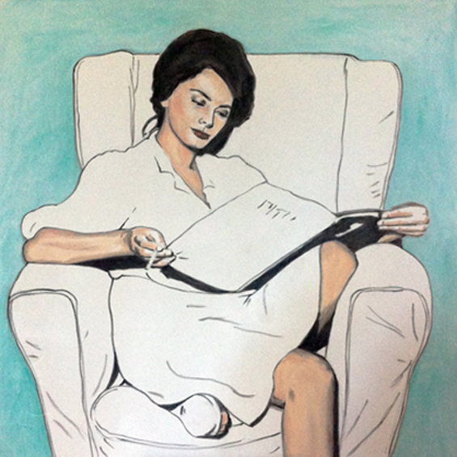
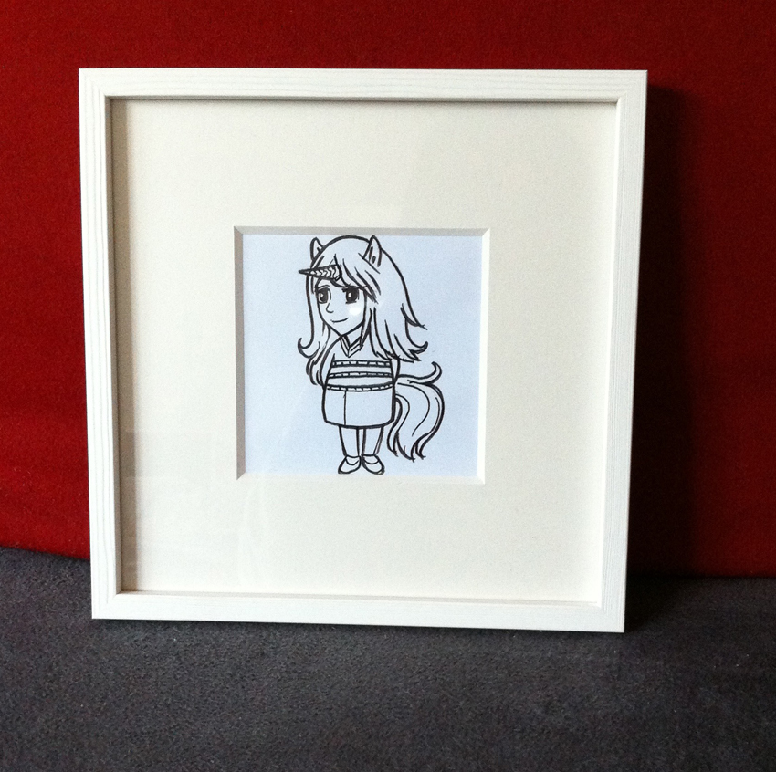
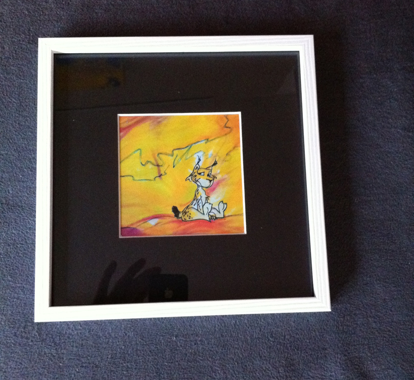
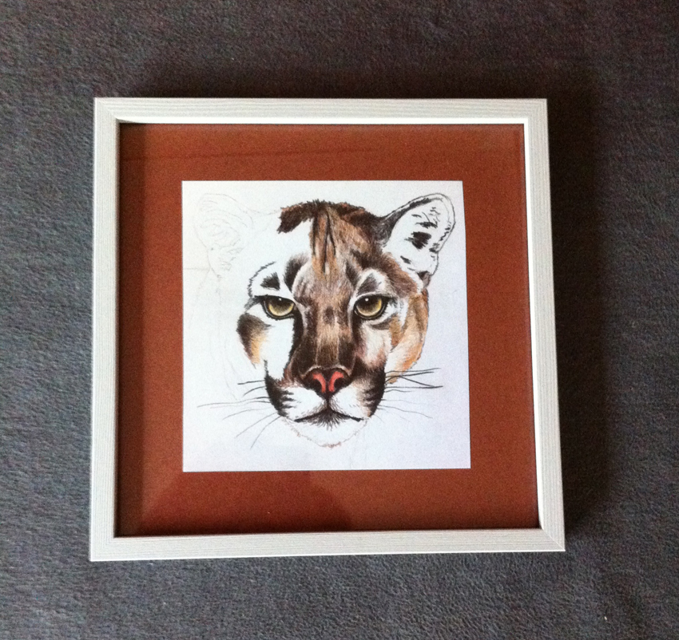
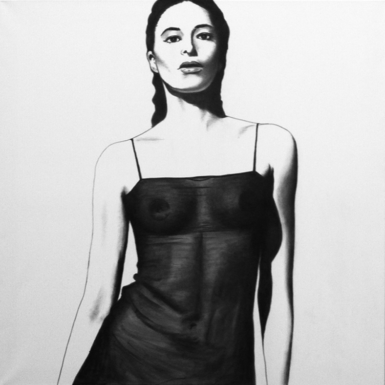
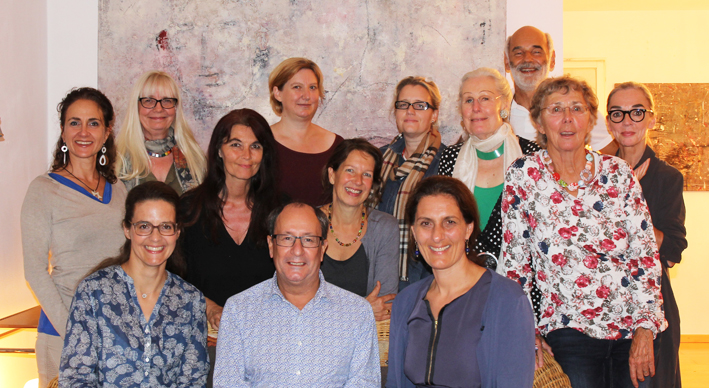

# Dipl. Grafik Designerin/Künstlerin

## Illustration - Portrait - Malerei - Zeichnung - Kunst - Kurse - Grafik - Comic - Bildhauerei

Herzlich willkommen auf meiner Webseite. Sie finden mich in München-Trudering

Wir sind mit unserem 100% zertifizierten Biofoodtruck in München und Umgebung unterwegs.    

*"Biofoodtruck" RuzaNera, Food&Art, bio - organic - glutenfrei - frisch - regional - tasty*    

Wir sind online
 [www.biofoodtruck.net](http://www.biofoodtruck.net) 

## Der Winter ist da. Eisige Nächte und Schnee.
## Schneebedeckte Hügel und Felder.Der Atem wird sichtbar. Atmen ist Leben.

## Seid kreativ.

## Buddha:
Glaubt den Schriften nicht,
glaubt den Lehren nicht,
glaubt auch mir nicht,
glaubt nur das, was ihr selbst
sorgfältig geprüft und als euch selbst
und zum Wohle dienend anerkannt habt.

 

## Neu
## Kurse für März und April 2023 sind da!
[Kurse Winter/Frühjahr 2023](http://www.schlaffer.net/kunst-kurse.php) 

NEU *Hommage an Sophia und das Lesen eines gedruckten Buches
(Pastell auf Leinwand 80 cm x 80 cm)*
Dieses Kunstwerk ist zur Zeit im Haarer Rathaus ausgestellt.

# Verkaufsaktion
Suchen Sie noch ein Geschenk für Geburtstag, Hochzeit oder Jubiläum?

# Kunstkarten, Kunstdrucke und einen Gutschein.

# *Unterricht ist zur Zeit nur vereinzelt möglich, wegen der Corona-Maßnahmen!* 

# Sie können gerne einen Gutschein für Einzelunterricht verschenken.

    
# Kunstprojekt Video [Atem ist Leben-Portrait (Musik)](https://www.youtube.com/watch?v=Rrac-Q8iooo) 

*Alles in Unordnung....! Atem ist Leben! 
Isolierung, Distanz, Einsamkeit statt Nähe, Umarmungen, Berührungen...Atem geraubt! 
(Kohle/Pastell auf Leinwand 1m x 1m)*

*Licht und Schatten "Starke Frau" mit Grautönen dazwischen 
(Kohle/Pastell auf Leinwand 1m x 1m)*

 [9.Waldtruderinger  Ateliertage](http://www.ateliertage-waldtrudering.de/Die-Kuenstler/Karina-Schlaffer/) November 2022 
 

 
Sie können gerne einen Termin mit mir vereinbaren. 
Ich zeige ihnen persönlich meine Kunstwerke. 
(Zur Zeit nur Einzelführung möglich)

 
