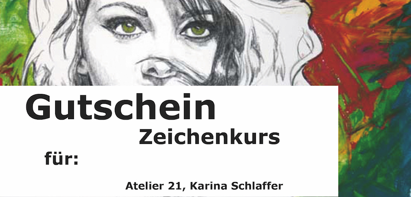

## Kunst- und Zeichenschule in der Edeltraudstr. 21, 81827 München
 

# Kursangebot Winter/Frühjahrssemester 2023:

## Kurse von Karina Schlaffer: 
(mehr Infos:  [Presse](http://www.schlaffer.net/muenchen-presse.php "Presse Karina Schlaffer"))

# Einzelunterricht findet statt!

# Sie können gerne einen Gutschein für Einzelunterricht verschenken!
     

"Gutschein" 
Infos: kschlaffer@web.de

# Kursangebot Winter/Frühjahrssemester 2023 Atelier 21:

## Kurse von Karina Schlaffer: 
(mehr Infos:  [Presse](http://www.schlaffer.net/muenchen-presse.php "Presse Karina Schlaffer"))

# Die Kurse finden in der Edeltraudstr. 21 statt. 
Leider darf ich keine Kurse mehr in der VHS Haar geben,
da ich mich weigerte den Gesundheitsstatus meiner Schüler abzufragen.
Ich bin der Meinung, dass diese Daten unter den Datenschutz fallen.
Es tut mir sehr leid, für alle meine Schüler, die gerne zu mir in den Kurs gekommen sind. Es hat viel Spaß mit euch gemacht.

Nun biete ich Kurse in meinem Atelier 21 an. 
Jeder ist herzlich willkommen.

## Für Winter/Frühjahr 2023 sind folgende Kurse im Atelier21 geplant:

Figürliches Zeichnen, fortlaufender Kurs, jeden Mittwoch 
Mittwoch von 18.00 bis 19.30 Uhr 
Ort: Edeltraudstr. 21

## März 2023
Aquarellmalen, 18. März 2023
Samstag von 11.00 Uhr bis 16.00 Uhr
Ort: Atelier 21, Edeltraudstr. 21, München
Für Anfänger und Fortgeschrittene, 110 Euro

Handlettering/Kalligrafie, 19. März 2023
Sonntag von 11.00 Uhr bis 16.00 Uhr
Ort: Atelier 21, Edeltraudstr. 21, München
Für Anfänger und Fortgeschrittene, 110 Euro

## April 2023
Handlettering/Kalligrafie, 08. April 2023
Samstag von 11.00 Uhr bis 16.00 Uhr
Ort: Atelier 21, Edeltraudstr. 21, München
Für Anfänger und Fortgeschrittene, 110 Euro

Aquarellmalen, 09. April 2023
Sonntag von 11.00 Uhr bis 16.00 Uhr
Ort: Atelier 21, Edeltraudstr. 21, München
Für Anfänger und Fortgeschrittene, 110 Euro

Aquarellmalen,, 29. April 2023
Samstag von 11.00 Uhr bis 16.00 Uhr
Ort: Atelier 21, Edeltraudstr. 21, München
Für Anfänger und Fortgeschrittene, 110 Euro

Handlettering/Kalligrafie, 30. April 2023
Sonntag von 11.00 Uhr bis 16.00 Uhr
Ort: Atelier 21, Edeltraudstr. 21, München
Für Anfänger und Fortgeschrittene, 110 Euro

# Möchten Sie wieder selbst schön schreiben lernen?
#### Handlettering/Kalligrafie
Hier lernen Sie die Grundlagen der Kalligrafie 
kennen, mit Zeichenfedern, Pinsel, Tusche und 
anderen Materialien.
“Kalligrafie ist die Lehre des Schönschreibens.”
Handlettering ist eine moderne Kunst, mit der man 
z.B. Grusskarten, Einladungskarten, Logos u.v.m.
verschönern kann. Es kommen auch vermehrt 
grafische Elemente zum Einsatz.
“Es ist die Kunst des Buchstaben-Zeichnens”

...oder andere Kurse nach Vereinbarung in der Edeltraudstr. 21 ab 2 Teilnehmern:

#### Comikzeichnen, Karikatur zeichnen, Portraitzeichnen Pastell,Tiere zeichnen, Figürliches Zeichnen, Grundzeichnen, Kalligrafie/Handlettering, Leinwand, Bäume zeichnen, Freies Zeichnen, auf den Spuren von Klimt, Aquarellmalen und vieles mehr.....
Bitte melden Sie sich bei mir, dann finden wir gemeinsam den richtigen Kurs für Sie und Ihre Lieben.

als Gruppe ab 2 Teilnehmern (wegen Corona) oder Einzelunterricht (ab 11 Jahren)

Sie können gerne einen Gutschein über Einzelunterricht verschenken.
Infos: kschlaffer@web.de 