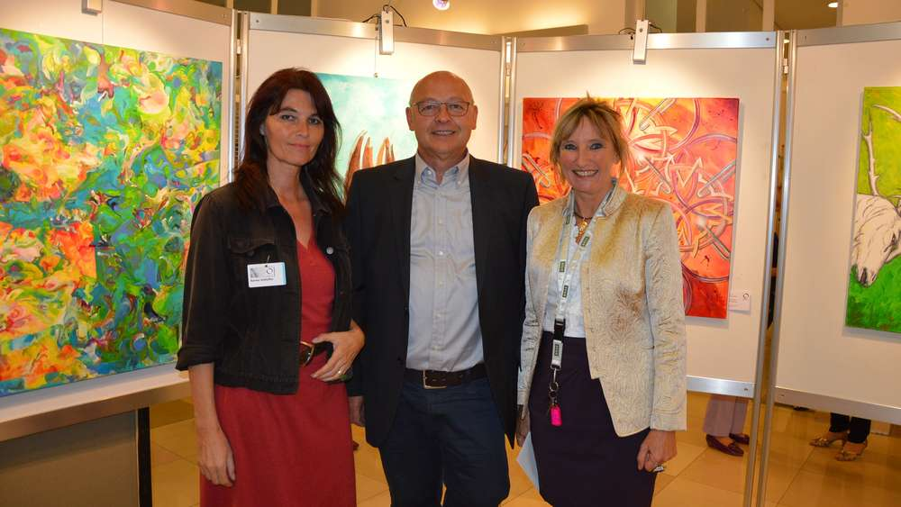
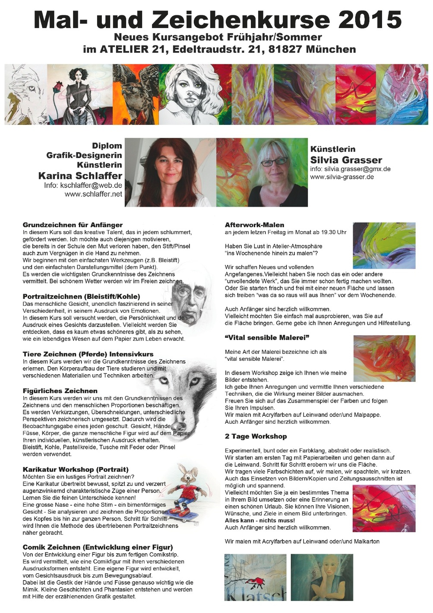
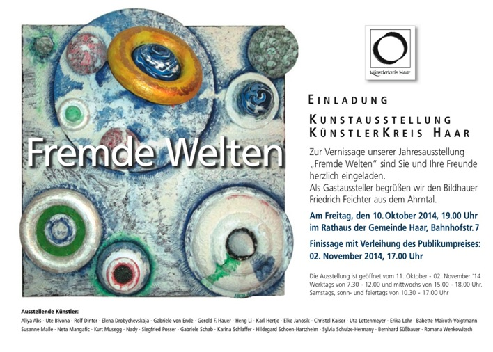
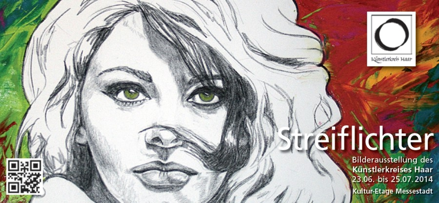
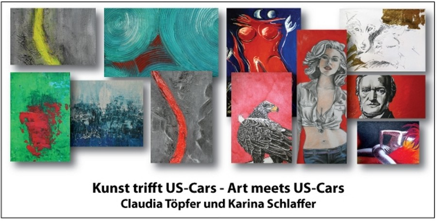

# Presse

Drei für die Kunst: (v.l.) Karina Schlaffer, Karl Hertje und Gabriele Schab sind die Vorsitzenden des Künstlerkreises Haar. Die jüngste Ausstellung „Berührungen“ zeigt 119 Arbeiten von 25 Künstlern des Kreises.

Aktualisiert: 14.10.15 - 15:44 im Münchner Merkur
AUSSTELLUNG
Die Vielfalt der Berührungen

Einmal im Jahr veranstaltet der Künstlerkreis Haar eine Ausstellung, in der 25 Künstler ihre Werke zeigen. Unter dem Motto „Berührungen“ entstanden 119 Arbeiten unterschiedlichster Stile und Techniken, Motive sowie Stimmungen.
Himmel und Erde, hell und dunkel, eine Gerade und ein Kreis, das Gras im Wind, aber auch Portraits und Tiere stehen für Berührungen. „Es liegt weniger in der Aufgabe des Künstlers denn in der des Betrachters, die Berührung zu erkennen“, sagte die Vorsitzende des Künstlerkreises, Gabriele Schab bei der Eröffnung. Dass das Thema „Berührungen“ durch die Flüchtlingsthematik derart aktuell sein würde, hätte niemand aus ihrem Kreis geahnt. „Einer Berührung, der ich nicht zustimme, macht mir Angst. Es geht aber auch anders, wenn man sich dem Prozess aussetzt, sich zu öffnen, Berührung zu zulassen“, sagte Bürgermeisterin Gabriele Müller. Jeder Künstler hat seine Gedanken in seiner ihm eigenen Technik umgesetzt. Diese Vielfalt macht die Ausstellung zu einem lebendigen Streifzug durch die Emotionen oder Geschichten, die jedes Werk erzählt, die Schab mit dem Satz „Es ist eine gute Augenwanderung“, auf den Punkt brachte. In den Jahren seines 35-jährigen Bestehens ist der Künstlerkreis Haar zu einer festen Größe im Ort geworden, es wird Wert gelegt auf zeichnerisches, bei Skulpturen und Plastiken auf handwerkliches Können, ebenso auf freies, mutiges Gestalten. „Wir treffen uns regelmäßig einmal im Monat, hier geht es um Anregungen und gegenseitige Hilfen oder Unterstützung, wir besprechen Arbeiten oder sitzen einfach nur gesellig beisammen“, sagt Karina Schlaffer, die dritte Vorsitzende des Kreises. Während der Ausstellung sind die Besucher aufgefordert, für drei ihrer Lieblingskünstler zu voten, jener mit den meisten Stimmen wird mit dem Publikumspreis geehrt 
##Kurse 2015/16 Herbst/Winter

## Einladung Künstlerkreis Haar

## Einladung Kultur-Etage Riem

## Einladung Geiger

