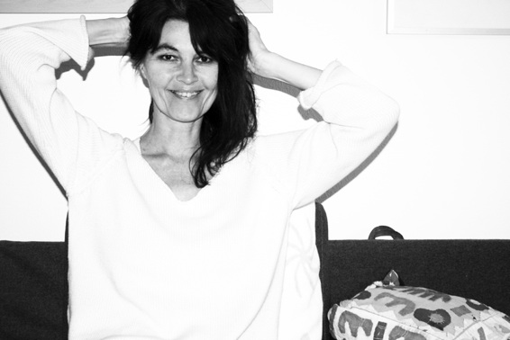

 

Karina Schlaffer ist 1964 in Regensburg geboren und lebt seit 2001 in München

2009 bis 2011 verbrachte sie in den USA New England ([Fairfield/Conneticut](http://de.wikipedia.org/wiki/Fairfield_(Connecticut))).

## Ausbildung

 

* 1982-1983:         Eigene kleine Galerie
* 1983-1985:         FOS-Gestaltung Nürnberg
* 1984:               Praktikum bei [Prof. Gerhard Wendland](http://de.wikipedia.org/wiki/Gerhard_Wendland_(Maler)) (Nürnberg)
* 1985:             Europäischer Jugendpreis im Plakatwettbewerb
* 1986:            Besuch der privaten Kunstschule Regensburg ([Cornelius Richter](http://www.cornelius-richter.com/))
* 1987-1992:         Studium an der FHS-Gestaltung Würzburg
* 1992:             Abschluss als Dipl. Grafik-Designerin (Schwerpunkt: Illustration Dr. Sarafov/München) 

Seit 1992 freiberuflich in Regensburg und München tätig als: Grafik-Designerin, Künstlerin, Illustratorin, Comikzeichnerin, Malerin 

freie Lehrtätigkeit in künstlerischen Bereichen: 

Porträtzeichnen · Aktzeichenen · Figürliches Zeichnen · Karikatur  · Grundzeichnen · visuelle Kommunikation · Comiczeichnen

* 1993-1995:         Vier Regensburger Kultfilme: als Co-Autorin, Schauspielerin, Regieassistentin
* 2007:            Mitglied beim [Künstlerkreis Haar](http://kkhaar.de/ "Zur Website Künstlerkreis Haar")
* 2010:            Workshop bei Enid Hutton USA
* 2010:             Mitglied bei FAC Fairfield/Connecticut USA
* 2011:             Mitglied bei Westport Arts Center/CT USA
* 2014 -2019:            Bronzekurs bei [Andrea Matheisen München](http://www.andrea-matheisen.de/index.html "Matheisen Bronze")

        

 

 

 

## Einzelausstellungen:

* 1995:                  Ausstellung: „Weiblichkeit“ im Kunstkollektiv (Regensburg)
* 1999:             Ausstellung: „der Wolf“ in der Sigismundkapelle (Regensburg)
* 2000:             Ausstellung: „Expressionen“ (Falkenstein)
* 2017:             Ausstellung: "Portraits" Schnitzelwirt (Markt Schwaben)
* 2019-2020:             Ausstellung: "Portraits" Amedia Hotel in Schwabing München

## Gemeinschaftsausstellungen:

* 1983:             Ausstellung: „Gewalt gegen Frauen“
* 2001:            Ausstellung in der „[Wurstkuchel](http://www.wurstkuchl.de "Zum Wurstkuchl")“ mit Comic-Aquarellzeichnungen
* 2002:             Gemeinschaftsausstellung: „Kunst von Unten“ in der Säulenhalle (Regensburg)
* 2002-2005:         Ausstellungsbeteiligung an Jahresausstellungen des Kunst und     Gewerbevereins  Regensburg (Katalogaufnahme)
* 2006:             Comikausstellung (Stadtbibliothek Regensburg)
* 2006:             Ausstellungsbeteiligung „50 Jahre Karikatur in Regensburg“
* 2008-2014:        Jahresausstellung KKH im Rathaus Haar
* 2009:             Gemeinschaftsausstellung in München Riem
* 2009:            "Kaleidoskop" in München Trudering Kulturzentrum
* 2010:            FAC Fairfield Connecticut USA
* 2011:            Ausstellung bei Strassenbanner in Fairfield CT USA
* 2011:            Ausstellung "Salon" in Fairfield CT USA
* 2012:            Ausstellung bei Salzburg
* 2013:            "obacht" Ausstellung in München
* 2013:            Ausstellung bei Geiger US Cars in München 
* 2013:            Beteiligung am "offenen Atelier" München Trudering
* 2014:            Ausstellung in der "Etage" München Riem: Streiflichter
* 2015:            Ausstellung "This is how we do it" Kunstforum-Arabellapark München
* 2015:            Jahresausstellung KKH Rathaus Haar "Berührungen"
* 2016:            "Pinselgeschichten" im Bürgerhaus Kirchheim
* 2016:            "Horizonte" im Rathaus Haar
* 2017:            "Kunstoase" im Kulturzentrum Trudering/München
* 2017:            Jahresausstellung KKH "Grün" im Rathaus Haar
* 2018:            "Kaleidoskop" Ausstellung in Landsberg am Lech
* 2018:            "Kunstoase" Ausstellung im Kulturzentrum Trudering
* 2018:            "Sichtweisen" Ausstellung im Rathaus Haar
* 2019:            "Kaleidoskop" Ausstellung in Ottobrunn
* 2019:            "Spur" Ausstellung im Rathaus Haar
* 2014-2019        Ateliertage Waldtrudering München
* 2020:            Künstlerkreis im öffentlichen Raum (Plakataktion)
* 2020:            8. Ateliertage Waldtrudering München (verschoben wegen Corona)
* 2021:            Künstlerkreis Haar Jahresausstellung "40 + 1"
## Auszeichnungen, Preise:

* 1985:             Europäischer Jugendpreis im Plakatwettbewerb

 

## Bucherscheinungen:

* Büchlein: Wiesnhits (Oktoberfest München 2016) Herausgeberin: Susanne Straubinger Meiller
* 3 Comikbüchlein (buntehunde Verlag) - [Comikbücher kaufen](https://editionbuntehunde.de/epages/893d1ce3-dd98-49cb-a448-04191d6789a2.sf/de_DE/?ObjectPath=/Shops/893d1ce3-dd98-49cb-a448-04191d6789a2/Products/978-3-934941-81-6)
* Pädagogische Bücher für Wolf Verlag, Gollwitzverlag 

## Filme:
* 2020 Kunstprojekt Video (youtube): "Atem ist Leben-Portrait II (leise) 2020"([Atem ist Leben](https://www.youtube.com/watch?v=slLuByy1v9g))

* 1993-1995:         Vier Regensburger Kultfilme in Super 8.
Als Co-Autorin, Schauspielerin, Regieassistentin in Zusammenarbeit mit Rainer Fürst